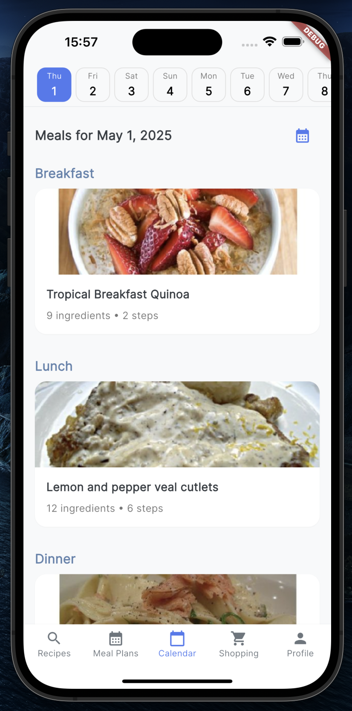

# Cheffy Landing Page Plan

## Project Overview

**Project Name:** cheffy-landing
**Repository Location:** /Users/jok/Projects/cheffy-landing
**Domain:** cheffyapp.recipes
**Purpose:** Create a landing page for the Cheffy app that showcases its features, screens, and provides access to the privacy policy.

## Prompt for Implementation

```
I need your help creating a GitHub Pages landing page for my Cheffy app. I've set up a new repository at /Users/jok/Projects/cheffy-landing with all the necessary assets (screenshots, icons, etc.) as discussed. Please help me implement the landing page according to the plan we created, including the HTML, CSS, and JavaScript code, setting up the CNAME file for my domain (cheffyapp.recipes), and ensuring the privacy policy page is properly linked. The landing page should showcase my app's features, display the app screenshots, and match my brand's color scheme.
```

## Assets Needed

### Icons
- `cheffy-icon.png` (from root directory)
- Web icons (from cheffy/web/icons):
  - Icon-192.png
  - Icon-512.png
  - Icon-maskable-192.png
  - Icon-maskable-512.png

### Screenshots
From `cheffy/store_assets/ios/iphone_6_5/`:
- 01_search_screen.png
- 02_meal_plan.png
- 03_calendar.png
- 04_shopping_list.png
- 05_profile.png

## Brand Colors
- Primary: #4E7AF0 (Vibrant blue)
- Secondary: #6C63FF (Purple)
- Tertiary: #00C2CB (Teal)
- Accent: #FF7A5A (Coral)
- Neutral (dark): #212529
- Neutral (light): #F8F9FA

## Site Structure

```
cheffy-landing/
├── index.html              # Main landing page
├── privacy-policy.html     # Privacy policy page
├── css/
│   └── styles.css          # Main stylesheet
├── js/
│   └── main.js             # JavaScript for animations and interactions
├── images/
│   ├── icons/              # App icons
│   │   ├── favicon.ico
│   │   ├── icon-192.png
│   │   ├── icon-512.png
│   │   └── ...
│   └── screenshots/        # App screenshots
│       ├── search-screen.png
│       ├── meal-plan.png
│       └── ...
└── CNAME                   # GitHub Pages CNAME file
```

## Page Sections

### 1. Hero Section
- App logo
- App name and tagline
- App Store and Google Play download buttons
- Hero image showing the app on a phone

### 2. Features Section
- Key features with icons and brief descriptions
- Based on the app description:
  - Discover recipes
  - Plan meals
  - Smart shopping lists
  - Personalized recommendations

### 3. App Screenshots Showcase
- Interactive carousel/slider showing all 5 app screens
- Brief description of each screen's functionality

### 4. How It Works
- Step-by-step guide on how to use the app
- Illustrations or icons for each step

### 5. Testimonials (Optional)
- User testimonials or reviews
- Ratings from app stores

### 6. Download Section
- Call to action for downloading the app
- App Store and Google Play buttons
- QR code for direct download

### 7. Footer
- Links to Privacy Policy
- Copyright information
- Contact information

## HTML Structure (index.html)

```html
<!DOCTYPE html>
<html lang="en">
<head>
    <meta charset="UTF-8">
    <meta name="viewport" content="width=device-width, initial-scale=1.0">
    <title>Cheffy - Your Personal Meal Planning Assistant</title>
    <meta name="description" content="Discover, plan, and organize recipes with AI-powered meal planning and smart shopping lists.">
    
    <!-- Favicon and App Icons -->
    <link rel="icon" type="image/png" href="images/icons/favicon.ico">
    <link rel="apple-touch-icon" href="images/icons/icon-192.png">
    
    <!-- Open Graph / Social Media Meta Tags -->
    <meta property="og:title" content="Cheffy - Your Personal Meal Planning Assistant">
    <meta property="og:description" content="Discover, plan, and organize recipes with AI-powered meal planning and smart shopping lists.">
    <meta property="og:image" content="images/og-image.png">
    <meta property="og:url" content="https://cheffyapp.recipes">
    
    <!-- Stylesheets -->
    <link rel="stylesheet" href="css/styles.css">
    
    <!-- Google Fonts -->
    <link rel="preconnect" href="https://fonts.googleapis.com">
    <link rel="preconnect" href="https://fonts.gstatic.com" crossorigin>
    <link href="https://fonts.googleapis.com/css2?family=Poppins:wght@300;400;500;600;700&display=swap" rel="stylesheet">
</head>
<body>
    <!-- Header -->
    <header>
        <div class="container">
            <div class="logo">
                
                <h1>Cheffy</h1>
            </div>
            <nav>
                <ul>
                    <li><a href="#features">Features</a></li>
                    <li><a href="#screenshots">Screenshots</a></li>
                    <li><a href="#how-it-works">How It Works</a></li>
                    <li><a href="privacy-policy.html">Privacy Policy</a></li>
                </ul>
            </nav>
        </div>
    </header>

    <!-- Hero Section -->
    <section id="hero">
        <div class="container">
            <div class="hero-content">
                <h1>Your Personal Meal Planning Assistant</h1>
                <p>Discover, plan, and organize recipes with AI-powered meal planning and smart shopping lists.</p>
                <div class="app-buttons">
                    <a href="#" class="app-button app-store">
                        
                    </a>
                    <a href="#" class="app-button google-play">
                        
                    </a>
                </div>
            </div>
            <div class="hero-image">
                
            </div>
        </div>
    </section>

    <!-- Features Section -->
    <section id="features">
        <div class="container">
            <h2>Why Choose Cheffy?</h2>
            <div class="features-grid">
                <div class="feature-card">
                    <div class="feature-icon discover"></div>
                    <h3>Discover New Recipes</h3>
                    <p>Explore a vast collection of recipes tailored to your preferences and dietary needs with an intuitive swipe interface.</p>
                </div>
                <div class="feature-card">
                    <div class="feature-icon plan"></div>
                    <h3>Plan Your Meals</h3>
                    <p>Take the stress out of meal planning with our intuitive calendar interface. Drag and drop recipes to any day of the week.</p>
                </div>
                <div class="feature-card">
                    <div class="feature-icon shop"></div>
                    <h3>Smart Shopping Lists</h3>
                    <p>Automatically generate shopping lists from your meal plans. Combine ingredients across multiple recipes for efficient shopping.</p>
                </div>
                <div class="feature-card">
                    <div class="feature-icon personalize"></div>
                    <h3>Personalized For You</h3>
                    <p>The more you use Cheffy, the smarter it gets. Learn your flavor preferences and dietary restrictions.</p>
                </div>
            </div>
        </div>
    </section>

    <!-- Screenshots Section -->
    <section id="screenshots">
        <div class="container">
            <h2>App Screenshots</h2>
            <div class="screenshot-slider">
                <div class="screenshot-container">
                    <div class="screenshot active" id="screenshot-1">
                        
                        <div class="screenshot-info">
                            <h3>Recipe Discovery</h3>
                            <p>Swipe through recipe cards to quickly find meals that catch your eye.</p>
                        </div>
                    </div>
                    <div class="screenshot" id="screenshot-2">
                        
                        <div class="screenshot-info">
                            <h3>Meal Planning</h3>
                            <p>Plan your meals with an intuitive drag-and-drop interface.</p>
                        </div>
                    </div>
                    <div class="screenshot" id="screenshot-3">
                        
                        <div class="screenshot-info">
                            <h3>Calendar View</h3>
                            <p>View your weekly or monthly meal schedule at a glance.</p>
                        </div>
                    </div>
                    <div class="screenshot" id="screenshot-4">
                        
                        <div class="screenshot-info">
                            <h3>Shopping Lists</h3>
                            <p>Automatically generate shopping lists from your meal plans.</p>
                        </div>
                    </div>
                    <div class="screenshot" id="screenshot-5">
                        
                        <div class="screenshot-info">
                            <h3>User Profile</h3>
                            <p>Customize your preferences and dietary restrictions.</p>
                        </div>
                    </div>
                </div>
                <div class="screenshot-nav">
                    <button class="nav-dot active" data-screenshot="screenshot-1"></button>
                    <button class="nav-dot" data-screenshot="screenshot-2"></button>
                    <button class="nav-dot" data-screenshot="screenshot-3"></button>
                    <button class="nav-dot" data-screenshot="screenshot-4"></button>
                    <button class="nav-dot" data-screenshot="screenshot-5"></button>
                </div>
            </div>
        </div>
    </section>

    <!-- How It Works Section -->
    <section id="how-it-works">
        <div class="container">
            <h2>How It Works</h2>
            <div class="steps">
                <div class="step">
                    <div class="step-number">1</div>
                    <h3>Discover Recipes</h3>
                    <p>Browse through our collection of recipes and find ones that match your preferences.</p>
                </div>
                <div class="step">
                    <div class="step-number">2</div>
                    <h3>Create Meal Plans</h3>
                    <p>Drag and drop recipes into your weekly calendar to create a meal plan.</p>
                </div>
                <div class="step">
                    <div class="step-number">3</div>
                    <h3>Generate Shopping List</h3>
                    <p>Automatically create a shopping list based on your meal plan.</p>
                </div>
                <div class="step">
                    <div class="step-number">4</div>
                    <h3>Shop Efficiently</h3>
                    <p>Use the organized shopping list to quickly get everything you need.</p>
                </div>
                <div class="step">
                    <div class="step-number">5</div>
                    <h3>Cook and Enjoy</h3>
                    <p>Follow the recipes and enjoy delicious, home-cooked meals.</p>
                </div>
            </div>
        </div>
    </section>

    <!-- Download Section -->
    <section id="download">
        <div class="container">
            <h2>Download Cheffy Today</h2>
            <p>Transform the way you plan, shop, and cook. From meal inspiration to grocery shopping, Cheffy is your companion for a more organized, efficient, and enjoyable culinary experience.</p>
            <div class="app-buttons">
                <a href="#" class="app-button app-store">
                    
                </a>
                <a href="#" class="app-button google-play">
                    
                </a>
            </div>
        </div>
    </section>

    <!-- Footer -->
    <footer>
        <div class="container">
            <div class="footer-content">
                <div class="footer-logo">
                    
                    <h3>Cheffy</h3>
                </div>
                <div class="footer-links">
                    <h4>Links</h4>
                    <ul>
                        <li><a href="#features">Features</a></li>
                        <li><a href="#screenshots">Screenshots</a></li>
                        <li><a href="#how-it-works">How It Works</a></li>
                        <li><a href="privacy-policy.html">Privacy Policy</a></li>
                    </ul>
                </div>
                <div class="footer-contact">
                    <h4>Contact</h4>
                    <p>Email: <a href="mailto:info@cheffyapp.recipes">info@cheffyapp.recipes</a></p>
                </div>
            </div>
            <div class="footer-bottom">
                <p>&copy; 2025 Cheffy. All rights reserved.</p>
            </div>
        </div>
    </footer>

    <!-- JavaScript -->
    <script src="js/main.js"></script>
</body>
</html>
```

## CSS Styles (styles.css)

```css
/* Base Styles */
:root {
    /* Brand Colors */
    --primary: #4E7AF0;
    --secondary: #6C63FF;
    --tertiary: #00C2CB;
    --accent: #FF7A5A;
    
    /* Neutral Colors */
    --neutral-100: #F8F9FA;
    --neutral-200: #F1F3F5;
    --neutral-300: #E9ECEF;
    --neutral-400: #DEE2E6;
    --neutral-500: #ADB5BD;
    --neutral-600: #6C757D;
    --neutral-700: #495057;
    --neutral-800: #343A40;
    --neutral-900: #212529;
    
    /* Semantic Colors */
    --success: #4CAF50;
    --warning: #FFC107;
    --error: #FF5252;
    --info: #2196F3;
    
    /* Gradients */
    --primary-gradient: linear-gradient(135deg, var(--primary), var(--secondary));
    --accent-gradient: linear-gradient(135deg, var(--tertiary), var(--accent));
    
    /* Typography */
    --font-family: 'Poppins', sans-serif;
    --h1-size: 3rem;
    --h2-size: 2.5rem;
    --h3-size: 1.75rem;
    --h4-size: 1.25rem;
    --body-size: 1rem;
    --small-size: 0.875rem;
    
    /* Spacing */
    --spacing-xs: 0.25rem;
    --spacing-sm: 0.5rem;
    --spacing-md: 1rem;
    --spacing-lg: 2rem;
    --spacing-xl: 3rem;
    --spacing-xxl: 5rem;
    
    /* Border Radius */
    --radius-sm: 4px;
    --radius-md: 8px;
    --radius-lg: 16px;
    --radius-xl: 24px;
    --radius-full: 9999px;
    
    /* Shadows */
    --shadow-sm: 0 1px 3px rgba(0, 0, 0, 0.1);
    --shadow-md: 0 4px 6px rgba(0, 0, 0, 0.1);
    --shadow-lg: 0 10px 15px rgba(0, 0, 0, 0.1);
    --shadow-xl: 0 20px 25px rgba(0, 0, 0, 0.1);
}

* {
    margin: 0;
    padding: 0;
    box-sizing: border-box;
}

html {
    scroll-behavior: smooth;
}

body {
    font-family: var(--font-family);
    color: var(--neutral-900);
    background-color: var(--neutral-100);
    line-height: 1.6;
}

.container {
    width: 100%;
    max-width: 1200px;
    margin: 0 auto;
    padding: 0 var(--spacing-lg);
}

h1, h2, h3, h4, h5, h6 {
    margin-bottom: var(--spacing-md);
    font-weight: 600;
    line-height: 1.3;
}

h1 {
    font-size: var(--h1-size);
}

h2 {
    font-size: var(--h2-size);
    text-align: center;
    margin-bottom: var(--spacing-xl);
}

h3 {
    font-size: var(--h3-size);
}

h4 {
    font-size: var(--h4-size);
}

p {
    margin-bottom: var(--spacing-md);
}

a {
    color: var(--primary);
    text-decoration: none;
    transition: color 0.3s ease;
}

a:hover {
    color: var(--secondary);
}

ul {
    list-style: none;
}

img {
    max-width: 100%;
    height: auto;
}

section {
    padding: var(--spacing-xxl) 0;
}

/* Header Styles */
header {
    background-color: white;
    box-shadow: var(--shadow-sm);
    position: sticky;
    top: 0;
    z-index: 100;
    padding: var(--spacing-md) 0;
}

header .container {
    display: flex;
    justify-content: space-between;
    align-items: center;
}

.logo {
    display: flex;
    align-items: center;
}

.logo img {
    height: 40px;
    margin-right: var(--spacing-sm);
}

.logo h1 {
    font-size: 1.5rem;
    margin-bottom: 0;
    color: var(--primary);
}

nav ul {
    display: flex;
}

nav ul li {
    margin-left: var(--spacing-lg);
}

nav ul li a {
    color: var(--neutral-700);
    font-weight: 500;
}

nav ul li a:hover {
    color: var(--primary);
}

/* Hero Section */
#hero {
    background: var(--primary-gradient);
    color: white;
    padding: var(--spacing-xxl) 0;
}

#hero .container {
    display: flex;
    align-items: center;
    justify-content: space-between;
}

.hero-content {
    flex: 1;
    padding-right: var(--spacing-xl);
}

.hero-content h1 {
    font-size: 3.5rem;
    margin-bottom: var(--spacing-lg);
}

.hero-content p {
    font-size: 1.25rem;
    margin-bottom: var(--spacing-xl);
}

.hero-image {
    flex: 1;
    display: flex;
    justify-content: center;
}

.hero-image img {
    max-height: 600px;
    border-radius: var(--radius-lg);
    box-shadow: var(--shadow-xl);
}

.app-buttons {
    display: flex;
    gap: var(--spacing-md);
}

.app-button img {
    height: 50px;
}

/* Features Section */
#features {
    background-color: white;
}

.features-grid {
    display: grid;
    grid-template-columns: repeat(auto-fit, minmax(250px, 1fr));
    gap: var(--spacing-xl);
}

.feature-card {
    background-color: var(--neutral-100);
    border-radius: var(--radius-lg);
    padding: var(--spacing-xl);
    text-align: center;
    box-shadow: var(--shadow-md);
    transition: transform 0.3s ease, box-shadow 0.3s ease;
}

.feature-card:hover {
    transform: translateY(-5px);
    box-shadow: var(--shadow-lg);
}

.feature-icon {
    width: 80px;
    height: 80px;
    margin: 0 auto var(--spacing-lg);
    border-radius: var(--radius-full);
    display: flex;
    align-items: center;
    justify-content: center;
    background: var(--primary-gradient);
}

.feature-card h3 {
    color: var(--primary);
    margin-bottom: var(--spacing-md);
}

/* Screenshots Section */
#screenshots {
    background-color: var(--neutral-200);
}

.screenshot-slider {
    position: relative;
    max-width: 350px;
    margin: 0 auto;
}

.screenshot-container {
    position: relative;
    overflow: hidden;
    border-radius: var(--radius-lg);
    box-shadow: var(--shadow-lg);
}

.screenshot {
    display: none;
}

.screenshot.active {
    display: block;
}

.screenshot img {
    width: 100%;
    display: block;
}

.screenshot-info {
    background-color: rgba(0, 0, 0, 0.7);
    color: white;
    padding: var(--spacing-lg);
    position: absolute;
    bottom: 0;
    left: 0;
    right: 0;
    text-align: center;
}

.screenshot-nav {
    display: flex;
    justify-content: center;
    margin-top: var(--spacing-lg);
}

.nav-dot {
    width: 12px;
    height: 12px;
    border-radius: var(--radius-full);
    background-color: var(--neutral-400);
    border: none;
    margin: 0 var(--spacing-xs);
    cursor: pointer;
    transition: background-color 0.3s ease;
}

.nav-dot.active {
    background-color: var(--primary);
}

/* How It Works Section */
#how-it-works {
    background-color: white;
}

.steps {
    display: flex;
    flex-wrap: wrap;
    justify-content: center;
    gap: var(--spacing-xl);
}

.step {
    flex: 1;
    min-width: 200px;
    max-width: 300px;
    text-align: center;
    padding: var(--spacing-lg);
}

.step-number {
    width: 50px;
    height: 50px;
    background: var(--primary-gradient);
    color: white;
    border-radius: var(--radius-full);
    display: flex;
    align-items: center;
    justify-content: center;
    font-size: 1.5rem;
    font-weight: bold;
    margin: 0 auto var(--spacing-md);
}

/* Download Section */
#download {
    background: var(--accent-gradient);
    color: white;
    text-align: center;
}

#download h2 {
    color: white;
}

#download .app-buttons {
    justify-content: center;
    margin-top: var(--spacing-xl);
}

/* Footer */
footer {
    background-color: var(--neutral-900);
    color: var(--neutral-300);
    padding: var(--spacing-xl) 0;
}

.footer-content {
    display: flex;
    flex-wrap: wrap;
    justify-content: space-between;
    margin-bottom: var(--spacing-xl);
}

.footer-logo {
    display: flex;
    align-items: center;
    margin-bottom: var(--spacing-lg);
}

.footer-logo img {
    height: 40px;
    margin-right: var(--spacing-sm);
}

.footer-logo h3 {
    color: white;
    margin-bottom: 0;
}

.footer-links h4,
.footer-contact h4 {
    color: white;
    margin-bottom: var(--spacing-md);
}

.footer-links ul li {
    margin-bottom: var(--spacing-sm);
}

.footer-links ul li a {
    color: var(--neutral-400);
}

.footer-links ul li a:hover {
    color: white;
}

.footer-contact p {
    margin-bottom: var(--spacing-sm);
}

.footer-contact a {
    color: var(--neutral-400);
}

.footer-contact a:hover {
    color: white;
}

.footer-bottom {
    text-align: center;
    padding-top: var(--spacing-lg);
    border-top: 1px solid var(--neutral-700);
}

/* Responsive Styles */
@media (max-width: 992px) {
    :root {
        --h1-size: 2.5rem;
        --h2-size: 2rem;
        --h3-size: 1.5rem;
    }
    
    #hero .container {
        flex-direction: column;
    }
    
    .hero-content {
        padding-right: 0;
        text-align: center;
        margin-bottom: var(--spacing-xl);
    }
    
    .app-buttons {
        justify-content: center;
    }
}

@media (max-width: 768px) {
    header .container {
        flex-direction: column;
    }
    
    .logo {
        margin-bottom: var(--spacing-md);
    }
    
    nav ul {
        justify-content: center;
    }
    
    nav ul li {
        margin: 0 var(--spacing-md);
    }
    
    .footer-content {
        flex-direction: column;
        align-items: center;
        text-align: center;
    }
}

@media (max-width: 576px) {
    .features-grid {
        grid-template-columns: 1fr;
    }
    
    .steps {
        flex-direction: column;
        align-items: center;
    }
}
```

## JavaScript (main.js)

```javascript
document.addEventListener('DOMContentLoaded', function() {
    // Screenshot slider functionality
    const screenshots = document.querySelectorAll('.screenshot');
    const navDots = document.querySelectorAll('.nav-dot');
    
    navDots.forEach(dot => {
        dot.addEventListener('click', function() {
            const targetId = this.getAttribute('data-screenshot');
            
            // Hide all screenshots and deactivate all dots
            screenshots.forEach(screenshot => {
                screenshot.classList.remove('active');
            });
            
            navDots.forEach(dot => {
                dot.classList.remove('active');
            });
            
            // Show the target screenshot and activate the clicked dot
            document.getElementById(targetId).classList.add('active');
            this.classList.add('active');
        });
    });
    
    // Auto-rotate screenshots every 5 seconds
    let currentScreenshot = 0;
    
    function rotateScreenshots() {
        screenshots.forEach(screenshot => {
            screenshot.classList.remove('active');
        });
        
        navDots.forEach(dot => {
            dot.classList.remove('active');
        });
        
        currentScreenshot = (currentScreenshot + 1) % screenshots.length;
        
        screenshots[currentScreenshot].classList.add('active');
        navDots[currentScreenshot].classList.add('active');
    }
    
    setInterval(rotateScreenshots, 5000);
    
    // Smooth scrolling for navigation links
    document.querySelectorAll('a[href^="#"]').forEach(anchor => {
        anchor.addEventListener('click', function(e) {
            e.preventDefault();
            
            const targetId = this.getAttribute('href');
            
            if (targetId === '#') return;
            
            const targetElement = document.querySelector(targetId);
            
            if (targetElement) {
                window.scrollTo({
                    top: targetElement.offsetTop - 80,
                    behavior: 'smooth'
                });
            }
        });
    });
    
    // Animate elements when they come into view
    const animateElements = document.querySelectorAll('.feature-card, .step, .screenshot-slider');
    
    function checkIfInView() {
        animateElements.forEach(element => {
            const elementTop = element.getBoundingClientRect().top;
            const elementVisible = 150;
            
            if (elementTop < window.innerHeight - elementVisible) {
                element.classList.add('animate');
            }
        });
    }
    
    window.addEventListener('scroll', checkIfInView);
    checkIfInView();
});
```

## Privacy Policy Page (privacy-policy.html)

```html
<!DOCTYPE html>
<html lang="en">
<head>
    <meta charset="UTF-8">
    <meta name="viewport" content="width=device-width, initial-scale=1.0">
    <title>Privacy Policy - Cheffy</title>
    <meta name="description" content="Privacy Policy for the Cheffy app.">
    
    <!-- Favicon and App Icons -->
    <link rel="icon" type="image/png" href="images/icons/favicon.ico">
    <link rel="apple-touch-icon" href="images/icons/icon-192.png">
    
    <!-- Stylesheets -->
    <link rel="stylesheet" href="css/styles.css">
    
    <!-- Google Fonts -->
    <link rel="preconnect" href="https://fonts.googleapis.com">
    <link rel="preconnect" href="https://fonts.gstatic.com" crossorigin>
    <link href="https://fonts.googleapis.com/css2?family=Poppins:wght@300;400;500;600;700&display=swap" rel="stylesheet">
    
    <style>
        .privacy-content {
            max-width: 800px;
            margin: 0 auto;
            padding: var(--spacing-xl) 0;
        }
        
        .privacy-content h1 {
            text-align: center;
            margin-bottom: var(--spacing-xl);
        }
        
        .privacy-content h2 {
            font-size: 1.75rem;
            text-align: left;
            margin-top: var(--spacing-xl);
            margin-bottom: var(--spacing-md);
            color: var(--primary);
        }
        
        .privacy-content ul {
            list-style: disc;
            margin-left: var(--spacing-xl);
            margin-bottom: var(--spacing-lg);
        }
        
        .privacy-content ul li {
            margin-bottom: var(--spacing-sm);
        }
        
        .privacy-content p {
            margin-bottom: var(--spacing-lg);
        }
    </style>
</head>
<body>
    <!-- Header -->
    <header>
        <div class="container">
            <div class="logo">
                
                <h1>Cheffy</h1>
            </div>
            <nav>
                <ul>
                    <li><a href="index.html">Home</a></li>
                    <li><a href="index.html#features">Features</a></li>
                    <li><a href="index.html#screenshots">Screenshots</a></li>
                    <li><a href="index.html#how-it-works">How It Works</a></li>
                </ul>
            </nav>
        </div>
    </header>

    <!-- Privacy Policy Content -->
    <section>
        <div class="container">
            <div class="privacy-content">
                <h1>Privacy Policy</h1>
                <p><em>Last Updated: May 1, 2025</em></p>
                
                <h2>Introduction</h2>
                <p>Welcome to Cheffy ("we," "our," or "us"). We respect your privacy and are committed to protecting your personal data. This privacy policy explains how we collect, use, disclose, and safeguard your information when you use our mobile application (the "App").</p>
                <p>Please read this privacy policy carefully. If you do not agree with the terms of this privacy policy, please do not access the App.</p>
                
                <h2>Information We Collect</h2>
                <h3>Personal Data</h3>
                <p>We may collect personal information that you voluntarily provide to us when you:</p>
                <ul>
                    <li>Create an account</li>
                    <li>Use the App's features</li>
                    <li>Contact us for support</li>
                    <li>Participate in surveys or promotions</li>
                </ul>
                
                <p>The personal information we collect may include:</p>
                <ul>
                    <li>Email address</li>
                    <li>First and last name</li>
                    <li>Profile information (such as profile pictures)</li>
                    <li>User-generated content (recipes, meal plans, shopping lists)</li>
                    <li>Usage data and preferences</li>
                </ul>
                
                <h3>Automatically Collected Information</h3>
                <p>When you use our App, we may automatically collect certain information, including:</p>
                <ul>
                    <li>Device information (model, operating system, unique device identifiers)</li>
                    <li>IP address</li>
                    <li>App usage statistics</li>
                    <li>Diagnostic data</li>
                </ul>
                
                <h2>How We Use Your Information</h2>
                <p>We use the information we collect to:</p>
                <ul>
                    <li>Provide, maintain, and improve the App</li>
                    <li>Create and manage your account</li>
                    <li>Process and fulfill your requests</li>
                    <li>Send you technical notices and updates</li>
                    <li>Respond to your comments and questions</li>
                    <li>Understand how users interact with our App</li>
                    <li>Detect, prevent, and address technical issues</li>
                    <li>Comply with legal obligations</li>
                </ul>
                
                <h2>Data Sharing and Disclosure</h2>
                <p>We may share your information in the following situations:</p>
                <ul>
                    <li><strong>Service Providers</strong>: We may share your information with third-party vendors who provide services on our behalf, such as hosting, data analysis, and customer service.</li>
                    <li><strong>Legal Requirements</strong>: We may disclose your information if required to do so by law or in response to valid requests by public authorities.</li>
                    <li><strong>Business Transfers</strong>: We may share or transfer your information in connection with a merger, acquisition, reorganization, or sale of assets.</li>
                    <li><strong>With Your Consent</strong>: We may share your information for other purposes with your consent.</li>
                </ul>
                <p>We do not sell your personal information to third parties.</p>
                
                <h2>Data Security</h2>
                <p>We implement appropriate technical and organizational measures to protect your personal information. However, no method of transmission over the Internet or electronic storage is 100% secure, so we cannot guarantee absolute security.</p>
                
                <h2>Your Privacy Rights</h2>
                <p>Depending on your location, you may have certain rights regarding your personal information, including:</p>
                <ul>
                    <li><strong>Access</strong>: You can request access to your personal information.</li>
                    <li><strong>Correction</strong>: You can request that we correct inaccurate information.</li>
                    <li><strong>Deletion</strong>: You can request that we delete your personal information.</li>
                    <li><strong>Restriction</strong>: You can request that we restrict the processing of your information.</li>
                    <li><strong>Data Portability</strong>: You can request a copy of your information in a structured, commonly used format.</li>
                    <li><strong>Objection</strong>: You can object to our processing of your information.</li>
                </ul>
                <p>To exercise these rights, please contact us using the information provided in the "Contact Us" section.</p>
                
                <h2>Children's Privacy</h2>
                <p>Our App is not intended for children under 13 years of age. We do not knowingly collect personal information from children under 13. If you are a parent or guardian and believe your child has provided us with personal information, please contact us.</p>
                
                <h2>Changes to This Privacy Policy</h2>
                <p>We may update our privacy policy from time to time. We will notify you of any changes by posting the new privacy policy on this page and updating the "Last Updated" date.</p>
                
                <h2>Third-Party Services</h2>
                <p>Our App may contain links to or integrate with third-party services. We are not responsible for the privacy practices of these third parties. We encourage you to read their privacy policies before providing any information to them.</p>
                
                <h2>Data Retention</h2>
                <p>We will retain your personal information only for as long as necessary to fulfill the purposes outlined in this privacy policy, unless a longer retention period is required or permitted by law.</p>
                
                <h2>International Data Transfers</h2>
                <p>Your information may be transferred to and processed in countries other than the country in which you reside. These countries may have data protection laws that differ from those in your country. We will take appropriate measures to protect your information in accordance with this privacy policy.</p>
                
                <h2>Contact Us</h2>
                <p>If you have any questions about this privacy policy or our privacy practices, please contact us at:</p>
                <p>Email: <a href="mailto:privacy@cheffyapp.recipes">privacy@cheffyapp.recipes</a></p>
            </div>
        </div>
    </section>

    <!-- Footer -->
    <footer>
        <div class="container">
            <div class="footer-content">
                <div class="footer-logo">
                    
                    <h3>Cheffy</h3>
                </div>
                <div class="footer-links">
                    <h4>Links</h4>
                    <ul>
                        <li><a href="index.html">Home</a></li>
                        <li><a href="index.html#features">Features</a></li>
                        <li><a href="index.html#screenshots">Screenshots</a></li>
                        <li><a href="index.html#how-it-works">How It Works</a></li>
                    </ul>
                </div>
                <div class="footer-contact">
                    <h4>Contact</h4>
                    <p>Email: <a href="mailto:info@cheffyapp.recipes">info@cheffyapp.recipes</a></p>
                </div>
            </div>
            <div class="footer-bottom">
                <p>&copy; 2025 Cheffy. All rights reserved.</p>
            </div>
        </div>
    </footer>

    <!-- JavaScript -->
    <script src="js/main.js"></script>
</body>
</html>
```

## CNAME File

The CNAME file is a simple text file that tells GitHub Pages which domain to use for your site. For your domain cheffyapp.recipes, the CNAME file should contain:

```
cheffyapp.recipes
```

## Implementation Steps

1. **Set up the project structure**:
   - Create the directory structure as outlined above
   - Copy all required assets from the Cheffy app project

2. **Create the HTML files**:
   - index.html (main landing page)
   - privacy-policy.html (privacy policy page)

3. **Create the CSS and JavaScript files**:
   - css/styles.css
   - js/main.js

4. **Set up GitHub Pages**:
   - Create a new GitHub repository named "cheffy-landing"
   - Push the project files to the repository
   - Enable GitHub Pages in the repository settings
   - Set the source to the main branch

5. **Configure custom domain**:
   - Add the CNAME file to the repository
   - In your domain registrar, set up the following DNS records:
     - A record: @ → 185.199.108.153
     - A record: @ → 185.199.109.153
     - A record: @ → 185.199.110.153
     - A record: @ → 185.199.111.153
     - CNAME record: www → yourusername.github.io

6. **Verify and test**:
   - Check that the site loads correctly at cheffyapp.recipes
   - Test all links and navigation
   - Verify that the screenshots and app store links work
   - Test the responsive design on different devices
